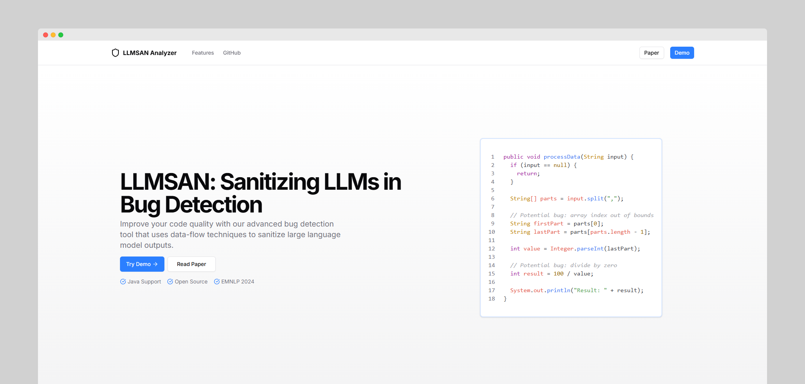

# LLMSAN

**LLMSAN** is the frontend interface for **LLMSAN** (Large Language Model Sanitizer), a system that uses LLMs to detect and sanitize bugs in source code. This interface allows developers to interact with the backend without needing to write API calls manually.



## Overview

LLMSAN is composed of two parts:

- **Backend**: [`llmsan-api`](https://github.com/dunnokiet/llmsan-api) – A FastAPI service that performs bug analysis and code sanitization using OpenAI models.
- **Frontend**: `llmsan-web` – A Next.js web application that communicates with the backend via REST APIs.

## Features

- Upload and analyze source code for bugs
- One-click code sanitization using LLMs
- Supports multiple bug types: NPD, DBZ, CI, APT, XSS
- Multi-language support via Tree-sitter grammars

## Getting Started

### 1. Clone This Repository

```bash
git clone https://github.com/dunnokiet/llmsan-api.git
cd llmsan-web
```

### 2. Install Dependencies

```bash
npm install
# or
yarn install
# or
pnpm install
# or
bun install
```

### 3. Create an `.env.local` file

```bash
touch .env.local
```

### 4. Define your environment variables

For example, to set the API base URL for backend requests:

```
API_BASE_URL=http://localhost:8000
```

### 5. Start the Development Server

```bash
npm run dev
# or
yarn dev
# or
pnpm dev
# or
bun dev
```

Open [http://localhost:3000](http://localhost:3000) with your browser to see the result.

## Backend Setup (`llmsan-api`)

To run the LLMSAN backend locally:

```bash
git clone https://github.com/dunnokiet/llmsan-api.git
cd llmsan-api

# Install dependencies
pip install -r requirements.txt

# Build Tree-sitter parsers
cd lib
python build.py
cd ..

# Set your OpenAI API key
echo "OPENAI_API_KEY=sk-xxxxxxxx" > .env.local

# Run the API server
python src/index.py
```

Then visit: http://localhost:8000/docs for the Swagger API.

## Contributing

Contributions are welcome! Please open an issue or submit a pull request for any improvements or bug fixes.
